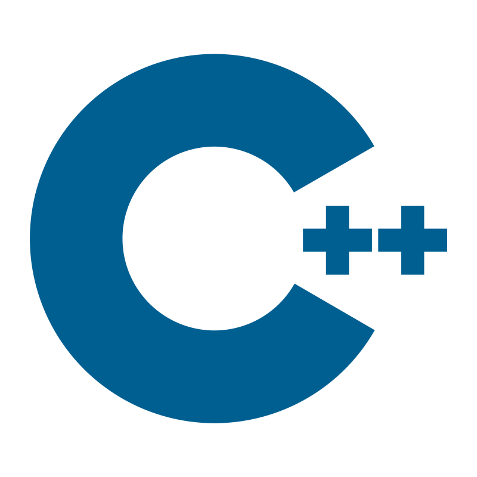

<h1 align="left" id="macropower-title"> Stay hungry, Stay foolish!</h1>
<h3 align="left">I am currently dedicated to the field of cryptocurrency quantitative trading.</h3>

  

  

  

 

- 💻 I'm currently all in Web3.

- 🔭 My current languages are **Java**,**Golang**, **Python**

- 😀 I like hiking, travelling, and reading in my free time.

- 💬 Ask me about fountain pens.

 

<h2 align="left" id="macropower-tech">Favorite Tech</h2>

> Tools, languages, and other things that I like to work with.

<table>
  <tr>
    <td align="center" width="96">
      
       Java
    </td>
    <td align="center" width="96">
      
       Go
    </td>
    <td align="center" width="96">
      
       Python
    </td>
    <td align="center" width="96">
      
       React
    </td>
    <td align="center" width="96">
      
       TypeScript
    </td>
    <td align="center" width="96"> 
      
       Docker
    </td>
    <td align="center" width="96">
      
       Kubernetes
    </td>
    

  </tr>
</table>

<h2 align="left" id="macropower-tech">Future goals</h2>

> Languages and skills planned to learn in the future
<table>
  <tr>
    <td align="center" width="96">
      
       C++
    </td>
    <td align="center" width="96">
      
       Rust
    </td>
    <td align="center" width="96">
      
       Blockchain
    </td>
    <td align="center" width="96">
      
       Quantitative trading
    </td>
    
    

  </tr>
</table>

<!-- links -->

[84.51°]: https://github.com/8451 "84.51° Github Home"
[issues page]: https://github.com/MacroPower/MacroPower/issues "MacroPower/issues"
[linkedin]: https://www.linkedin.com/in/colvinjm "Jacob Colvin LinkedIn"
[homelab]: https://github.com/MacroPower/homelab "MacroPower/homelab"
[blog]: https://jacobcolvin.com/posts/ "My Blog"

